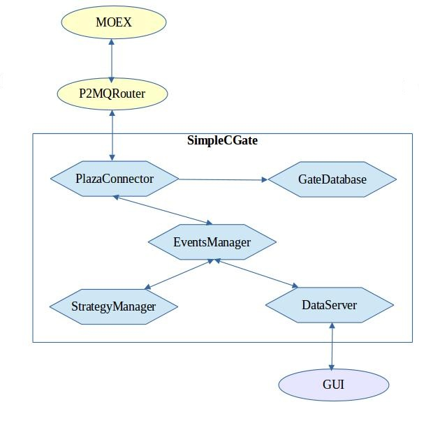

# SimpleCGate 
---

is a sample of implementation of a software application for access to the SPECTRA market using the P2 CGate library (the Moscow Exchange: the Derivatives Market).   


## Key features:

* The dictionary of instruments which are traded in a specific trading session (futures and calendar spreads).
* Receiving of the best ask and bid prices.
* Receiving current positions, trades, orders, a variational margin and the information on funds, limits.
* Trading operations: sending, moving and deleting orders.
* Ready to add the user trading logic.
* Ready to connect with the extern GUI.

---

## Main components:

**PlazaConnector**  – provides an interaction with the P2MQRouter: connection, receiving data, sending messages and orders.

**GateDatabase** – contains dictionaries of instruments, positions, orders and trades and provides thread-safe access to them. 

**StrategyManager** – controls the pool of trade strategies.

**DataServer** – provides an interaction with the GUI (the GUI is not included in this application).

**EventsManager** – provides communication between all the other parts. It is a "message dispatcher".




The project was created in the Visual Studio 2015.

The CGate installation link: ftp://ftp.moex.com/pub/FORTS/Plaza2/CGate/

The documentation link: ftp://ftp.moex.com/pub/FORTS/Plaza2/docs/

To get a test login, please, send an email to the technical support of the Moscow Exchange: help@moex.com

---

## EventsManager

The **EventsManager** provides communication between all other parts of the application. (Mediator pattern). The instance of this class has to be created before the **StrategyManager**, the **DataServer**, and the **PlazaConnector**. These subsystems add themselves into the **EventsManager** in their constructors.

Functions:
* `virtual void AddNewConsumer(IEventConsumer* const)` : enrolls the object as a messages receiver (usually called in a constructor of an object-consumer);
* `virtual void RemoveConsumer(const IEventConsumer*)` : dismisses the object from the pool of receivers;
* `virtual void AddEvent(Event::Types type, int global_id)` ;
* `virtual void AddEvent(Event::Types type)` : creates an "event message" and notifies all the registered consumers/receivers. The type of event describes what has happened. For example, some changes have happened in quotes, in a position or in an order, or a new trade have come.  global_id – is an identifier of an entity from the **GateDatabase** which the event is associated with. Each consumer processes its messages in a separated thread;
* `virtual void AddCommandEvent(const Command& com)` : creates a "command message" and notifies all the registered consumers/receivers. 


### IEventConsumer

All the consumers need to implement the **IEventConsumer** interface. The interface provides processing of messages in a separated thread. 

The function ```void EventProcess(const Event& _event)``` processes the "event messages", it should be implemented in each consumer class. 

---

## GateDatabase

The **GateDatabase** contains dictionaries of instruments, positions, orders and trades and provides thread-safe access to them. Each entity has a unique identifier (*global_id*) and can have additional identifiers provided by the MOEX. For example, *ISIN* and *isin_id* for Futures or *order_id* for Orders. The **GateDatabase** stores data in several data structures to provide fast access by any identifier.
  
The entities are created and modified only from the **PlazaConnector**. The **StrategyManager** and the **DataServer** are in the read-only mode.

Data:
1. Securities. Additional 'std::map' is for fast access by *ISIN*: ```std::map<std::string, std::shared_ptr<Security>> securities_;``` There are routines to get a contract (by *global_id* and *ISIN*), to create and to check the existence of a contract.    
2. Orders. Additional 'std::map' is for fast access by *user id*: ```std::map<unsigned int, std::shared_ptr<Order>> orders_;``` There are routines to get an order (by *global_id* and *user id*), to create and to check the existence of an order. To create an order, use these functions:
* `CreateOrder` – to make an order that was received from the MOEX (not created by the algorithm). 
* `CreateNewOrder` – to make a new order which will be sent to the MOEX.
3. Trades. Additional `std::map` is for fast access by *trade_id*: ```std::map<unsigned long long, std::shared_ptr<Trade>> my_trades_;``` There are routines to get a trade (by *global_id* and *trade_id*), to create and to check the existence of a trade. 
4. Positions. Additional std::map is for fast access by *ISIN*: ```std::map<std::string, std::shared_ptr<Position>> positions_;``` There are routines to get a position (by *global_id* and *ISIN*), to create and to check the existence of a position.
5. Strategies. A strategy does not have any additional identifier. There are routines to add a new strategy to the database and to get a strategy by *global_id*.
6. MoneyInfo. It is a simple data structure that contains the information on funds, limits.

---

## DataServer

It is a base for communication with the extern GUI. It stores entities from the **GateDatabase** in local containers that can be used for safe transmission (without any locks on the main threads) to other application. Also, it is a good place for receiving the user control command from the GUI. 

---

## StrategyManager

It controls a pool of strategies in two threads: the main thread and the background thread.
All the events that were received from other subsystems process in the main thread. Types of events: *New security*, *New trade*, *Changing order*, *Changing price*. Each strategy has to be subscribed on the changing prices only in used securities. It can be done by calling `StrategyManager::AddStrategy(<strategy>, <list of securities>)`

The background thread calls function `OnBackgroundEvent()` once in 50 ms for each strategy. It can be used as a place for updating indicators and so on.

The example of strategy creating:
```
auto sample_strategy = std::make_shared<SampleBidAskStrategy>(database);

sample_strategy->PostOrder = std::bind(&PlazaConnector::AddOrder, &plaza, std::placeholders::_1); //linking to operations with orders
sample_strategy->MoveOrder = std::bind(&PlazaConnector::MoveOrder, &plaza, std::placeholders::_1, std::placeholders::_2);
sample_strategy->CancelOrder = std::bind(&PlazaConnector::DeleteOrder, &plaza, std::placeholders::_1);

sample_strategy->LoadConfig();
algoManager.AddStrategy(sample_strategy, sample_strategy->GetUsedSecurity());
```
 

### Strategy

To implement the trading algorithm, you need to inherit from the basic abstract class **Strategy** and define the following functions:
* `void OnQuotesChange()`: the event occurs when a value of the best bid or ask price has been changed. It is a perfect place to make trade decisions and to create/cancel orders;
* `void OnOrderChange(const int id)`: the event occurs after an order from the MOEX has been received. Any change in an order generates the event;
* `void OnNewTrade(const int id)`: the event occurs after a new trade has been received;
* `void OnDisconnect()`: the event occurs when the PlazaConnector has been disconnected from the router;
* `void LoadConfig()`: it is a place for initializing and loading settings of the strategy;
* `void SaveConfig()`;
* `void OnBackgroundEvent()`; 
* `bool IsTradeTime(const DateTime& time)`: it should return True if now is the working time. 

---

## PlazaConnector

The *PlazaConnector* provides an interaction with the P2MQRouter: connection, receiving data, sending messages and orders. It contains **DataStreams** and their callbacks.

Receiving data is divided by several **DataStream** objects. Each of them processes data in the separated thread:
1. CommonStream receives data from FORTS_FUTCOMMON_REPL.
2. OrderStream receives data from FORTS_FUTTRADE_REPL.
3. ServiceStream receives data from FORTS_PART_REPL, FORTS_POS_REPL, FORTS_VM_REPL, FORTS_FUTINFO_REPL.

Receiving and processing data from the **DataStream** occur in the corresponding callback function. The **DataStream** contains only a wrapper function. Callback's implementation is in the **PlazaConnector**. The router calls the function and passes a pointer to data. The data structure sets by the scheme passed to the *Listener*.

See more about the replication scheme in the documentation: p2gate_en.pdf

The **PlazaConnector** reads settings from the file PlazaConfig.ini that contains:

[Main]
BrokerCode = ABCD
ClientCode = 999
Address = 127.0.0.1
Port = 4001
Fast = 0
TCP = 1

**BrokerCode** and **ClientCode** are identifiers for the plaza's login.
**Address** and **Port** are the P2MQRouter's address and port.
**Fast** - 1 to use fast data streams, 0 to use usual data streams.
**TCP** - 1 to use TCP for connection to router, 0 to use LRPCQ.
